> 不了解就无法真正拥有。  &nbsp;&nbsp;&nbsp;&nbsp; --歌德

## 背景知识
无论是clean architecture 还是 Big ball of mud，都需要一份完备的项目文档供团队成员统一设计思想。软件架构图是一种非常好的表达方式，它也是项目设计文档中必不可缺的一部分。 架构师可以用它们来表达如何构建一个软件系统（预先设计）或者现有的软件系统是如何工作的。<br>
含糊不清的软件架构图容易导致误解，这可能会拖慢一个优秀团队的前进步伐。<br>
C4 模型 代表：
1. 上下文（Context）
2. 容器（Container）
3. 组件（Component）
4. 代码（Code）


一系列分层的图表，可以用这些图表来描述不同缩放级别的软件架构，每种图表都适用于不同的受众。可以将其视为软件项目的谷歌地图。 


#### 第1 层：系统上下文

它显示了你正在构建的软件系统，以及系统与用户及其他软件系统之间的关系。以下是一个系统上下文图的示例，描述了一个互联网银行系统的系统上下文：

#### 第2 层：容器

它将软件系统放大，显示组成该软件系统的容器（应用程序、数据存储、微服务等）。技术决策也是该图的关键部分。以下是互联网银行系统的容器图示例。它显示了互联网银行系统（虚线框）由五个容器组成：服务器端Web 应用程序、客户端单页面应用程序、移动应用程序、服务器端API 应用程序和数据库。

#### 第 3 层：组件

将单个容器放大，以显示其中的组件。这些组件映射到代码库中的真实抽象（例如一组代码）。下面是一个虚拟的网上银行系统的组件图示例，显示了 API 应用程序中的一些组件（而不是全部）。

#### 第4 层：代码
最后，如果你确实想要，或者说有这个必要，可以放大个别组件，以显示该组件的实现方式。以下是一个虚拟的网上银行系统的UML 类图示例（部分），显示了组成MainframeBankingSystemFacade 组件的代码元素（接口和类）。


#### 符号
C4 模型没有预定义任何特定的符号，你在这些示例图中看到的是一个个简单的符号，适用于白板、纸张、便签、索引卡片和各种图表工具。你也可以使用 UML 作为符号，并适当使用包、组件和原型。无论你使用哪种符号，我都会建议让每个元素都包含名称、元素类型（即“人”、“软件系统”，“容器”或“组件”）、技术选型（如果有的话），以及一些描述性文字。在图表中包含如此多的文本可能看起来很不寻常，但这些附加文本有助于消除软件架构图中通常会出现的不明确的表示。

即使符号对你来说是显而易见的，仍然要确保为这些符号提供图例。图例中应该包括颜色、形状、首字母缩略词、线条样式、边框、尺寸等。理想情况下，符号应该在每个细节层次上保持一致。下面是前面显示的容器图的图例。


#### 更多信息
C4 模型是一种在不同抽象层次上交流软件架构的简单方法，可以向不同的受众讲述不同的故事。这也是向软件开发团队介绍（通常是重新引入）严谨和轻量级建模的一种方式。有关 C4 模型的更多信息，以及补充图（运行时和部署）的示例、符号清单、常见问题解答、会议讲座视频和工具选项，请参阅 [c4model.com](https://c4model.com) 。
## 环境准备

C4 模型本身是一种架构图绘制的组织理念、方法论，并不限于使用什么工具。C4作者推荐使用：

* C4PlantUML
* Structurizr 

本文选用的环境是 :
* Visual Studio Code (IDE) 
* PlantUML 
* PlantUML  Extension（VS Code extension） 
* C4-PlantUML (library)

1. Visual Studio Code  直接搜索安装
2. PlantUML
 PlantUML需要JAVA 、Graphviz 运行环境 非JAVA开发者 安装起来比较麻烦。
 Windows 用户可以使用[choco](https://chocolatey.org/install) 包管理工具 
 如果没有choco 可直接使用一下命令直接安装 Choco 和 PlantUML
 
 ``` PowerShell
 @"%SystemRoot%\System32\WindowsPowerShell\v1.0\powershell.exe" -NoProfile -ExecutionPolicy Bypass -Command "iex ((New-Object System.Net.WebClient).DownloadString('https://chocolatey.org/install.ps1'))" && SET "PATH=%PATH%;%ALLUSERSPROFILE%\chocolatey\bin"

choco install plantuml
 ```
 安装完成还会在桌面保存一个 plantuml 文档 供参考学习
3. VS Code  安装 PlantUML 扩展 

4. C4-PlantUML (包含 C4 Model 特有 的图形、符号) 需要在 **.puml** 文件中引入相关包 。

如果总是想使用最新的版本就引入

    !include  "https://raw.githubusercontent.com/plantuml-stdlib/C4-PlantUML/master/C4_Container.puml"

国内引用这个地址大概率会被🧱 <br>
常规使用以下方式引用即可。

    !include <C4/C4_Container>

如必须使用最新可前往[plantuml-stdlib/C4-PlantUML](https://github.com/plantuml-stdlib/C4-PlantUML)仓库保存到本地也🉑，具体方法自行百度。
## 基础语法

无论是时序图 、活动图、组件图、状态图 他们主要描述都是 单独主体的详情或者 主体与主体之间的关系。
* 主体可以是服务、对象、状态、组件等等； 
* 关系则可以是网络请求、依赖关系、接口调用、继承关系等等。

**主体** 使用component 、Container、 System、 ContainerDb等等各种各样的关键字来引用恰当的图形展示对象性质，再辅以文字描述即可描述清楚主体信息<br>
**关系** 则用各种各样的连接线 来描述主体与主体之间的联系、依赖、关系。

#### 主体
参数说明 ：
* alias 变量名
* label 标签名
* descr 描述信息
* sprite 图标 可使用 scale 缩小放大图标  etc.  $sprite="person2,scale=0.5"
* link 外链
* techn 使用技术
* tags 标签 多标签使用 '+'分隔

C4_Context.puml 包中关键字：

Macros:
* Person(alias, label, ?descr, ?sprite, ?tags, ?link)
* Person_Ext
* System(alias, label, ?descr, ?sprite, ?tags, ?link)
* SystemDb
* SystemQueue
* System_Ext
* SystemDb_Ext
* SystemQueue_Ext
* Boundary(alias, label, ?type, ?tags, ?link)
* Enterprise_Boundary(alias, label, ?tags, ?link)
* System_Boundary

C4_Container.puml：

Macros:
* Container(alias, label, ?techn, ?descr, ?sprite, ?tags, ?link)
* ContainerDb
* ContainerQueue
* Container_Ext
* ContainerDb_Ext
* ContainerQueue_Ext
* Container_Boundary(alias, label, ?tags, ?link)

C4_Component.puml
Macros:
* Component(alias, label, ?techn, ?descr, ?sprite, ?tags, ?link)
* ComponentDb
* ComponentQueue
* Component_Ext
* ComponentDb_Ext
* ComponentQueue_Ext

#### 关联

* Rel(from, to, label, ?techn, ?descr, ?sprite, ?tags, ?link)
* BiRel (bidirectional relationship)
 
也可以强制指定关系连线方向
* Rel_U, Rel_Up
* Rel_D, Rel_Down
* Rel_L, Rel_Left
* Rel_R, Rel_Right

#### 其他

显示简介：
*  LAYOUT_WITH_LEGEND()  展示所有
*  SHOW_FLOATING_LEGEND(?hideStereotype, ?details)  只展示用到的 而且可精细控制展示大小等等
* ... 

自定义距离：<br>
* Lay_Distance(from, to, ?distance) <br>指定主体与主体距离

指定布局方向:
* LAYOUT_TOP_DOWN()
* LAYOUT_LEFT_RIGHT()
* ....

C4 Model 还有诸如指定位置关系、自定义图标等等完善的功能，但为项目绘制C4Model 图这些预先知识基本就够了，如有其他请自行查阅官方文档。

## 简单示例



 


